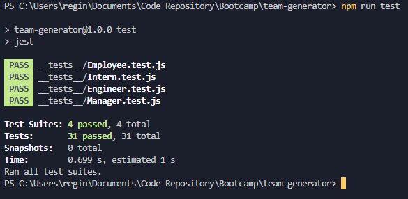
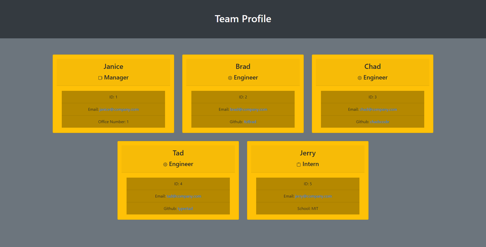

# Team Profile Generator

  [](https://opensource.org/licenses/MIT)

## New project, new team, new page to show them all off. Let's make that easier on you

Using this tool you can create a profile page for your team by filling out a form for each member and streamline the process significantly


## Table of Contents:
- [Installation](#installation)
- [Usage](#usage)
- [Tests](#tests)
- [Demo](#demo)
- [Credits](#credits)
- [License](#license)

## Installation

```
npm i
```

## Usage

```
node index.js
```

> ### If you want an example page generated by this tool, use
```
node index.js example
node index.js test
```

## Tests

```
npm run test
```



---

## Demo



## Credits

Author: Garrett Lee

## License

Licensed under the [MIT](https://opensource.org/licenses/MIT) license